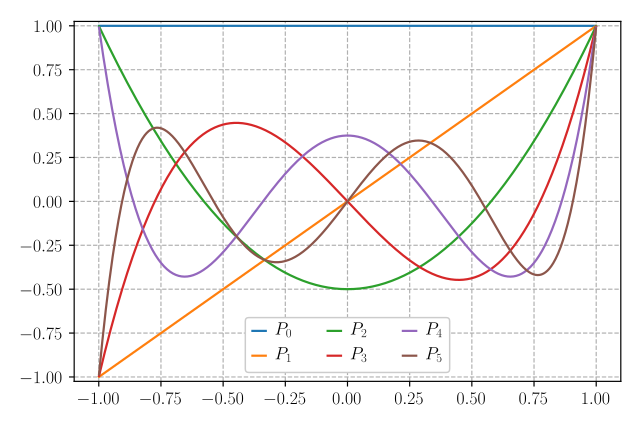
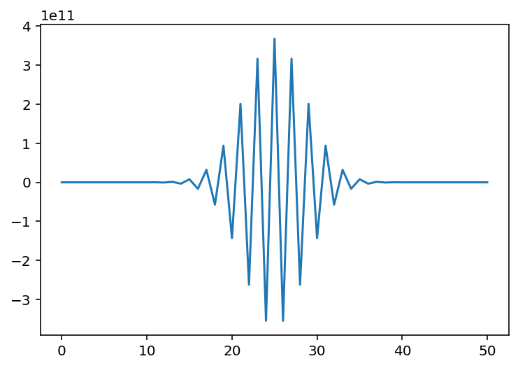
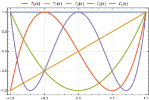
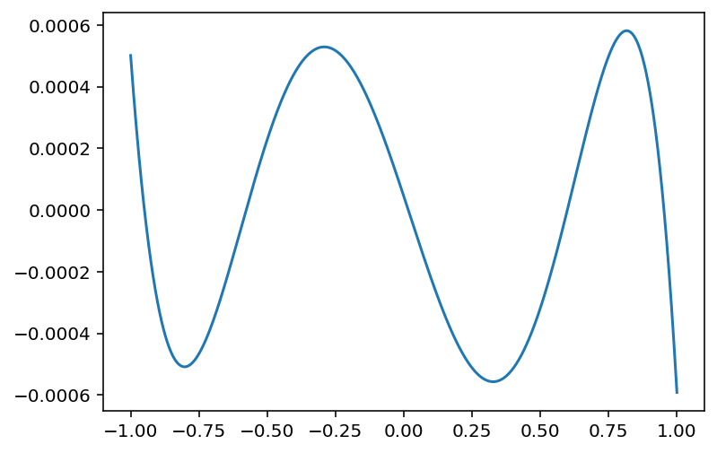
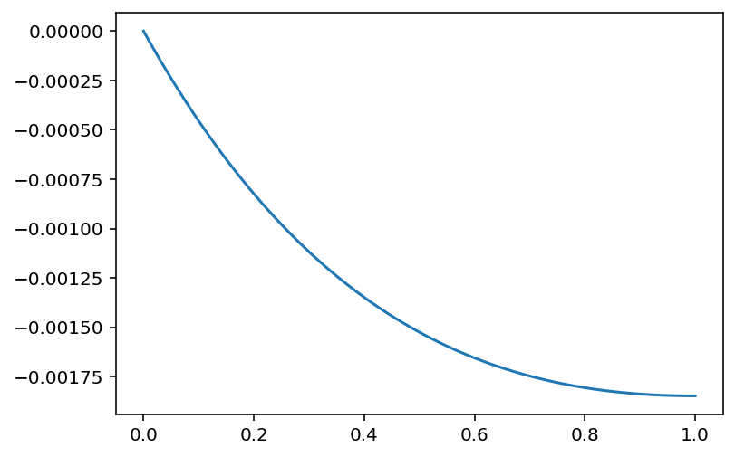

#### Lecture 1 - Aug ?

# Error in the Derivative

using classical definition of derivative: f'(x) = (f(x+dx)-f(x))/dx

then taylor expand both f(x+dx) and f(x)
substitute back into equation and get: f'(x) = f'(x) + dx^2 f''/2 + ...

but now try: f'(x) = (f(x+dx)-f(x-dx))/(2*dx) 
again taylor expand and sub back in and now the dx^2 terms dissapear due to sign

f'(x) = f'(x) + dx^2 f'''/6 + ...

error in taylor series decreases by factor of 100 - this answer is way more accurate
*have to worry about round off error because now is dominating
-> want to make dx larger

so for single precision would want like 0.1 and for double would be like 10e5

summary: free to pick dx whatever we want and so to get more accurate we choose 
        dx to be the cubed root fo the third derivative (equalling sides of the 
        equation) rather than the root of the second derivative

- see code showing this called deriv_class.py
- most accurate we can get is 10e-10

#### Lecture 2 - Sept 2

# Polynomial Interpolation/ Integration (class slides posted)

## Interpolation

if have a function given at certain points and asked to find the function 
value y at some other x value
- interpolation is when the new value is between already given function values
- extrapolation is when new value is outside of given function values

solutions:
- laziest way is to choose closest neighbour
- draw straight lines between points (also lazy)
- piecewise quadratic (not good usually)
**we want a smooth function a.k.a. something that can be defined by a taylor series

taylor series reminder
f(x) = 

- cubic (needs 4 points) use edge points and so thye match up on center point
    and is smooth
        -> see code from class cubic_attempt_class_py but indexing didn't work
        - cubic works well!
        - what about higher order?

I want to write a polynomial that goes through n points
- can write a polynomial that is 0 at specified number of points
    - ex. (x0 - x1)(x0 - x2)(..)(x0 - xn-1) which is 1 at x0 and 0 at all other values
say we have function y(x) = y0@x0, y1@x1, ... = y0P0 + y1P1 + y2P2 + ...
- could be defined by sum of polynomials P which go through zero except for point
    that they 'own' and so they wiggle a lot
    - see images in lecture slides

note that which many high order polynomials there can be large effects of small
errors and so not well behaved

checkin: cubic worked ok and was continuous. did nto need fit for each 
interpolated point, could store every interval and coeff
- no need evenly spaced given function values

### Cubic Splines

our cubic fit, was it continuous? we did not check :( 

splines: forces function and first n order derivatievs to be continuous 
        (usually 1st and 2nd)
        - so second deriv needs to match right and left neighbours (usually set to 0)
        - cubic most common to be a spline
        - see code cubic_spline_class.py
        - really fancy is Bplines found in scipy.interpolate

### Rational Functions

poles review (omfg complex analysis)

ex. function: f(x) 1/ (2 + x^2) which is not analytic at x = i
- taylor series work in the complex plane (since function is analyic)
- interpolation with spline will fail at some point

f(x) = P(x)/(1 + qq(x))

if i use a polynomial and extrapolate to long distances then they will move and 
change very steeply when out of the range we fitted them in

basically have will have 

(P0 + P1 x + P2 x^2 + .. ) / ( 1 + qq1 x + qq2 x^2 + ..) = y(x)
rearrange to 
P0 + P1 x + P2 x^2 ... - ( 1 + qq1 x + qq2 x^2 + ..) = y(x)

now have a matrix and can solve for all unknowns 
(if have that same amount of function values)

#### Lecture 3 - Sept 4

wrote code for the equation above 

f(x) = P(x)/(1 + qq(x))

for a gaussian
- code called ratfit_class.py

in code we try using n=2 and m=4 but get a splot where it fits fine but there
is a spike exactly at x=0
- if change to n=3 it works well (basically perfect polynomial fit to the points)
- only rational functions can fit these points to the gaussian so well 
    (even outside the range of points)
- n=4 and n=6 also has spike

gaussian is an even function
- n=3 is the qudratic so it is even so the fit works
- n=4 is an odd polynomial so the extra odd term does not do good

if multiply top and bottom by same thing (polynomial factor)  that causes the 
spike since the inverse blows up due to an undetermined term
- but, if have something that doesn't work like n=2 and m=6 can change this one line:
    fitp=np.linalg.inv(A)@y to fitp=np.linalg.pinv(A)@y to fix

what is pinv?
- normal when inverse works it makes eigenvalues go to 1/eigenvalues
- pseudo inverse will set 1/0=0 instead of infinity so does not break

summary: rational functions often behave better outside the region of specified values
        though they do sometimes have singularies and some issues that polys don't

note: rational functions are much less supported than polyfits

## Integration

Interpolation and integration are closely couples

If i'm trying to numerically inetrgate between a set of values I want to be able to 
interpolate what happens in that interval then integrate that
- fairly easy with polynomials
- usually end up with a set of coeff times function values wehre coeff set by scheme
    you've chosen to do the integration
- can think of this as finding the 'average' value in a region, based on some
    interpolation scheme

### Integration with Linear

interpolating by drawing a straight line between points of a fucntion
- the average value would be the average of the endpoints of each region
- if spaced by dx, the area of the interval would be average*dx
    - so area/dx = 0.5(y0+y1) + 0.5(y1+y2) + ... + 0.5(yn-2+yn-1)
                = 0.5(y0 + yn-1) + sum(yi), i=1,2...n-2
                = the ends plus the middles

wrote a code to determine if this is true called interp_linear_class.py
- got pretty well (error less than a thousandth)
- how would we expect error to scale by number of points?
    - think about taylor expansion, the linear expansion gets first order term right,
        second order term survives, get third order that when integrate turns into second 
        order answer and so would expect error in tengral to go like 1/number of points^2
    - error scales like 1/(number of points^2)
    - if increase number of points by factor of two then error should go down by a factor of 4

can we use this scheme to figure out a better answer?
- if i use some value of dx I get my ans+eps*dx**2 where eps is some error we don't understand
    and some higher order terns = int(dx)
- if i use 2 dx I get ans+eps*(2dx)*2 = ans+4eps dx^2 = int(2dx)
- 4 * int(dx) - int(2x) = 4*ans + 4*eps*dx**2 - (ans+4*eps*dx^2) = 3*ans+.. (higher)
    - so i can use ans=(4*int(dx)-int(2dx))/3

wrote a code to simulate this called interp_linear_combo.py
by using this we get a new smaller error of 3.05e-6
- got a much more accurate answer with not much extra work
- error would divide by 16 in doubled amount of points
    - leading term in taylor series is now the 4th deg term
- by being more clever in how to use functions can get much smaller error

### Integration with quadratic with 3 points

see code called quad_int_class.py
- introduce simpson's rule

# Legendre Polynomials 

we want to do even better but will need legendre polynomials since regular polynomials will 
not work

we generate legendre polynomials through a recurrance relationship
- where the previous terms are used to determine the following term in the polynomial
- (n+1)P_(n+1) = (2n+1)xP_n - nP_(n-1), P_0=1, P_1=x
- this is a set of polynomials each term increasing in order

Lengendre polynomilas are:
- bound on -1 to 1 
- integral of any two polynomials are zero if n does not equal m
    - int(P_n * P_m)= delta_n,m

visualized legendre polynomials on legendre.py

want to know inetgral of P_n for any n between 1 to 1
- for P_0 the integral is 2 since P_0 is 1
- for any other legendre polynomial the integral will be zero (can see this in the code visualization)

therefore, I can fit legendre poly to a set of data and the netgral will be the P_0 coeff!

legendre fitting: y_i = sum(c_j P_j(x_i))
- if figure out c_j then we good
- this is a matrix equation -> y=Pc and P is square if we have as many polynomials as we have points
    meaning we could use c=P^-1 y to solve for c, get c0 and we have integral
- but c_0 is just sum(P^(-1)_0,k y_k) so can just take first column of P^(-1) to get weights
- now can integrate to any order! (making sure i have suitable yi for the chosen order)

see code legendre_weights.py
- can see it essentially matches simpson's rule (up to order 2)

#### Lecture 4 - Sept 9

## Legendre Integration

we were trying to make a general way of numerically integrating arbitrary taylor series polynomial order

want to use Legendre polynomials since
- they are always bounded
- integral between any two legendre polynomials is 0 unless they are the same
    - essentially just have to find P0 coefficient for all info about integral
    - Can find set of weights to find all info

saw briefly with rational functions that we can use matrix if have same amount of variables as equations and use matrix inverse to get coeff.

say we have bound set of points with dx being spacing between the points
- if function is a constant x=1 what should integral across region of multiple points be?
    - each interval between points has an area of dx

want a set of weights such that Σ w_i f_i dx = integral estimate
- would need Σ w_i = 4 if have 5 points, if had three points Σ w_i = 2, etc
    - can check with simpson's rule (matches)

wrote code for this called legendre_weights_class.py
- when trying to integrate for a 4th order need 4 intervals (5 points) and would need 4n+1 points
- when using integrate_leg(np.exp,0,1,0.086,2) the output is 13
    - says that the closest we can get to odd number of points with 0.86 spacing is 13 points

- integrate_leg(np.exp,0,1,0.086,2): error = 4.6e-07
    - decrease dx by fatcor of 4, dx = 0.02: error = 1.5e-09 as expected
    - raise order from 2 to 4, error = 2.97e-13 showing that the function is smooth (well described by a taylor series)

things like lorentz which look smooth but are nto defined by taylor series 
- trying code with lorentz to integrate, dx = 0.2 still shows small error
    - when increase order from 2 to 4, error gets quite worse (~300x worse to be exact)

the right thing to do to integrate depends on what you are integrating

# Error estimates

we have done things with analytic error estimates since we have know what integral is and are able to compare

when we don't know the answer, how do we estimate the error??
- if in a region that is well described by taylor series we know how error will change 
    - say we compare f(4dx)&f(2dx) agaisnt f(2dx)&f(dx) we know that the error at WORST will be the difference between the estimates
    - also to check if in a happy taylor series, going from f(4dx) to f(2dx) should tell us rough the change of going from f(2dx) to f(dx)

simplest case: our error is difference between 2dx and dx for simpson's rule
- does this take extra function evaluations to do? 
    - can do simpson's rule using every function point
    - can also do simpson's rule using only every third point?
    - can get estimate with same points we had
    - can also do first, last and center point and check the difference of the errors (due to number of points) and if they follow that of 16x as we saw before then this can be described by a taylor series
- usually give error estimate to be difference between f(2dx) and f(dx) though is probably more accurate but may not be

see code legendre_error.py
- take best answer and answer with half as many poitns and use as error estimate
- we see that often the estimate is larger than the true error but never smaller

look at weights for simpson's rule
- get_weights(2): array([0.33333333, 1.33333333, 0.33333333])
- get_weights(4): array([0.31111111, 1.42222222, 0.53333333, 1.42222222, 0.31111111])
- get_weights(6): array([0.29285714, 1.54285714, 0.19285714, 1.94285714, 0.19285714, 1.54285714, 0.29285714])
- get_weights(50), see plot below

sum of the weights is ~50 for 50th order
- weights are oscillating between large and small meaning we will not get an accurate number due to round off error 
    - will only get (best case) order 10^5 which we get much better from other methods

# More on Integration

### Romberg Integration

another way to get high order
- if i integrate from -a to a then only even terms survive in the integral
- if have n estimates of area with varying dx, can combine coarse estimates to kill off n terms in even error series giving accuracy of dx^2n
- more stable than higher order polynomial weights

remember, derived simpson's with the linear integrations to cancel taylor series error terms (combining two estimates to cancel higher order error terms)

can use this with scipy.integrate
- scipy.integrate.romb = integral from preevaluated points
- scipy.integrate.romberg = integral from function
 
### Indefinite Integral
Handy trick: integrate from a to b f(x) dx = int from 1/b to 1/a f(1/t) t^-2 dt for t = 1/x
- can now set say b to inf since 1/b = 0
- as long as function falls off quickly enough

say have 1/sqrt(x), our code for inetgrate_leg will not work becuase end point integrates to inf
- can use scipy.integrate.quad instead

### Variable step size
have used fixed dx so far but often not what we wanna do

return to lorenztian
- poles at +-i
- can use large dx anywhere but in the range near x=0 where we see the peak in the function
- could integrate in 3 parts

we could first try something simple and keep track of the error via error estimate
- first try simpson's rule form -500 to 500 with 2 interval and 1 interval and if error is small then we are done!
- of error is not small, shrink try from -500,0 and 0,500
- keep dividing into intervals until our error is good enough (smaller than whatever we define our bound ot be)

see code integrate_adaptive_class.py

#### Lecture 5 - Sept 11

last week: had written integrator that used less function evaluations yay but did not work properly with gaussian for large interval

** important **
we were integrating a gaussian with an offset from -20 to 20 which worked but when integrated form -25 to 15 it was wrong (sad)
- our adaptive integrator does a single simpson's step and evaluates with 3 points and 5 points and if the integrals match (enough) then we are done
- [-20,20] the points were (-20,-10,0,10,20) and since there is a point at 0 the integrator knows about the spike
- [-25, 15] the points are (-25, -15, -5, 5, 15) and so does not see spike and integral is very wrong
to fix this we just ened to make sure it uses the peak -> split into two integrals

### Gaussian Quadrature
problem: polynomials not quite orthogonal on evenly spaced points
legendre polynomials are not quite orthogonal when evaluating evenly spaced points
- cna get factor of 2 or higher order integration with same number of evaluations by picking x points carefully
- useful to calculated w(x)f(x) where w(x) is lowk weird like f(x)/sqrt(x)
- can look up gaussian quad weights

### Chebyshev Polynomials
class of polynomials defined by T_n = cos(n arccos(x)) on -1 to 1
- T_0 = 1, T_1 = x
- recurrance relation is T_(n+1) = 2x T_n - T_(n-1)

useful properties:
- max and min are 1 and -1 (since cosine) and roughly evenly spread throughout interval

say i did taylor expansion but used chebyshev polynomials as base funtion and wnated to drop last term in taylor series

f(x) = Σn T_n(x) C_n
but change to f(X) = Σ(n-1) T_n(x) C_n

the biggest error i would induce would be last coefficient
- for legendre at edges it is larger so would have larger error
- for chebyshev, the peaks are all 1 and -1, i basically spread error uniform across interval
    - if want to make function where error is same everywhere

derivation:
    T_n = cos(n arcos(x)), T_0 = 1, T_1 = x (as long as x between 1,-1)

    what is T_(n+1) = cos((n+1) arccos(x))
                    = cos(n arcos(x) - sin(n arcos(x)) sin( arcos(x))
    T_(n-1) = cos((n-1) arcos(x))
    if do same expansion get 
            = cos(n arcos(x)) + sin(n arcos(x)) sin( arcos(x))
    T_(n+1) + T_(n-1) = 2x T_n
    T_(n+1) = 2x T_n - T_(n-1) ** The important one

    T_2 = 2x^2 -1
    T_3 = 4x^3 - 2x - x
        = 4x^3 - 3x
    if i were ot generate T_4 the leading term would be ax^4 + ....
    T_5 = 16x^5 + ...
    T_20 = 2^20 x^20 + stuff

    coefficients keep getting larger but then when we go through all fo it they carefully cancel out to get numebrs between -1 and 1

do we wanna be differencing arge numebrs to get -1 and 1?? NO computer will be sad and take a lot of work to write out polynomials and cancel
- use recurrance relationship!!

see code: cheb_class.py to see cheb polynomails and cheb fit
- need ot make sure we get matrix correct to get coeff

T_o(x_0)    T_1(x_0)        c_0         y_0
T_0(x_1)    ...             c_1     
T_0(x_2)    ...             ...

we have T * c = y so can get coeff via c = T^-1 * y
- using code we do 20th order cheb fit and see the coeffs get very small very quickly until we get to the roundoff error
- in code we added a fit anf an evaluation and then plotted the error

error is kind of evenly distributed (not vastly different anywhere else)
- better way of expressing functions with error small as possible everywhere for least amount of work

look at cheb_expand.py where we see how a least squares fit goes crazy at end points which would be wildly incorrect if someone evaluated at endpoints

# ODEs
problem: before, given y(x) we were trying to undertsand how it would behave in the future

now we have y(x_0) and want to find y(x_0 + h) given dy/dx = f(x,y)
- harder than numerical integration because we don't know how to evaluate dy/dx along the path - that depends on the unknown value of y

basic problem:
    before we had dy/dx = f'(x), now we have dy/dx = f(x,y)

    * in ODE everyone uses h instead of dx lol...
    y_(n+1) = y_n + h(x_n,y_n)
    we want ot try and integrate by splitting the are ainto rectancles iwth the top left edge agaisnt the true function line

see code: ode_zeroth_class.py
- we solve for simple ode dy/dx = -y and we see that error stars at zero and goes to about 10^-3 ish

- if double the number of integrals (n) we would expect error to decrease by a factor of 2
    - this makes sense since we are at order 2? maybe
    - means we have to do twice as much more for factor fo 2 more accuracy.. not optimal

### Runge-Kutta
usually people use 4th order but we will derive 2nd roder since is hard :(

want to be clever about fuction evaluations to cancel higher order terms in taylor series
- but need to make rough guess of what y is doing to do what we want

y_(n+1) = y_n + a k_1 + b k_2
k_1 = h f(x_n, y_n)
k_2 = h f(x_n + α, y_n + β k_1)
goal: figure out a,b, and alpha and beta to match second order

y(x + h) = y(x) + h y'(x) + h^2/2 y''(x) + ... the taylor series expansion
remember y'(x) = f(x,y)
y(x + h) = y(x) + h f(x,y) + h^2/2 d/dx(f(x,y)) + ...
         = y(x) + h f(x,y) + h^2/2 (∂f/∂x + ∂/∂x (f dy/dx)) + h^2/2 (∂f/∂x + f ∂f/∂y)

to match up (matching firts order derivative)
h f a + h f b = h f   -->   a + b = 1
second order term
b α h^2 = h^2/2    -->   α b = 1/2, β b = 1/2 same for beta term

now have 4 unknowns and 3 equations
a + b = 1       assume a = b = 1/2
α b = 1/2       assume α = β = 1
β b = 1/2
we are assuming by approximating using the same rectangles we had split our integrla into except instead of drawing.a horizontal line at the top it is a slanted line leading to second order accuracy
- another sensible choice is to pick b = 1 where α = β = 1/2
    - don't use left edge at all but use alpha and beta to do half steps 
formally free to pick any choice

see code: rk2.py
- we do second order rk and get error decrease by 50x with only twice as much work
- if double number of steps we get factor of 4 more accurate
- also did other version with half a step and got same error

with rk4.py our error went down by crazy (with only 4x work)
- fourth order method
- doing twice a smuch work gives 16x mroe accurate answer

can do this for higher order equations
- if y is a vector and have system of equations and get vector dy/dx and can evaluate all the functions and get exact same things

#### Lecture 6 - Sept 16

#### Lecture 7 - Sept 18

# Linear Least Squares

PDF = Π_i exp(-1/2 (x_i - μ_i)^2 / σ_i^2)
errors on measurments are gaussian distributed
- CLM tell sus we will probs end up w gaussian anyways with many samples
- can solve analytically yay

can take -2 Log(PDF/2) = Σ ((x_i - μ_i)^2 / σ_1^2)  -->  χ^2  --> δχ^2

given two models what is the relative probability that would give us the data observed
- looking at ratio of the PDFs after taking the log becomes the difference
- can get everything we need to know from two models from the chi^2

if δχ^2 is high probs not a good fit to the data
if δχ^2 = 1, PDF = exp(-1/2 χ^2) so 
    PDF1/PDF2 = exp(-1/2 χ_1^2) / exp(-1/2 χ_2^2)
              = exp(-1/2 δχ^2)
    would bet that neither model is preferred
if δχ^2 = 100
    PDF1/PDF2 = = exp(-1/2 δχ^2) ~ e^-50 = 1 in a trillion of quadrillion
    everytime the bad model gives rise to the data, the other model is 1 in quad to give rise to the data

all of the complication for two mdoels is χ^2
    - best fit is the minimum χ^2

** now treat x as a vector
x --> d , mu --> mu (vector), σ_i^2 --> N_i --> 1/σ_i^2 --> N^-1

(d - μ)^T N^-1 (d-μ) which is equal to Σ ((x_i - μ_i)^2 / σ_1^2) 
- μ = Σ A_ij m_j = A m

say we fit a line to data (y = mx + b)
      x_0
y = ( x_1 ) ( b ).  with goal to find b and m that minimize χ^2
      x_2     m
      ...

if have μ = A m then χ^2 --> (d - Am)^T N^-1 (d - Am)
- to minimize take the deirvative and set to 0
- to take derivative of matrix it is the exatc same if you keep order

∂/∂m = m --> m + δm
     for δm --> 0, ((d - A (m + δm))^T N^-1 (d - A (m + δm))) / δm  - x_0 
    = (d - A (m + δm))^T N^-1 (d - A (m + δm)) - A δm N^-1 (d - A (m))
        (d - A (m)) N^-1 δm + A δm N^-1 (A δm)
    note that χ^2 is just a scalar after differentiation

    (δm^T A^T N^-1 (d - A m)) / δm = A^T N^-1 (d - A m) which is just a scalar where we have picked out ith element
    - for a given parameter the derivative is a scalar
    --> -2 A^T N^-1 (d - A m) which is full vector if do not pull out an element
    differentiate above: -A^T N^-1 (d - Am) - (d - Am)^T N^-1 A
                        = -2 A^T N^-1 (d-Am) = gradient of χ^2

want to find value of m to minimize χ^2
-2 A^T N^-1 (d-Am) = 0
A^T N^-1 d - A^T N^-1 Am = 0
A^T N^-1 A m = A^T N^-1 d    this is our linear least squares 

what does A look like? 
- if have 1000 data points there are 1000 rows of A
- if fitting a line have 2 parameters so vector has two entries so A would be 1000x2
- in general A is not square so cannot multiple the linear least squares by A^-1 on the left to cancel out the matrix

say d has 1000 entries (vector) then N would be square (1000x1000) and A (1000x2) and A^T (2x1000), m is a vector with 2 entries, and A^T N^-1 A is 2x2 whihc is square and can be inverted
- m = (A^T N^-1 A)^-1 A^T N^-1 d.  ** very important
- be aware, maybe is invertible analytically but not on computer

see code: linfit_class.py
- add random noise to a polynomial and calculate m
- where if we have all sigma = 1 then N becomes the identity matrix and goes away
- if noise is the same everywhere can just ignore N

if you are fitting a polynomial of unknwon order, how do you know order?
- we do not want extra parameter since simplest model is best
- chi^2 naturally goes down ~1 for each added parameter however will not see drastic change is chi^2 if parameter is not necessary
- increasing the order should alwyas do as least as well as previous answer
- when fit is trying to follow the noise it is not good and we do not like
- went form 15 to 10th order the χ^2 went up by 300 
    - happened because computer had roundoff error since is not evaluating analytically
    - the inverse makes us nervous for roundoff error

what is happening with an inverse?
    - we know A^T N^-1 A is square but also using (ABC)^T = C^T B^T A^T we get A^T N^-1 A = A^T N^-1 A a.k.a. our matrix is symmetric!
    for symmetric matric and want to understand the inverse we want to take the eigen values and eigen vectors (eigen vectors orthogonal for hermitian matrix)

    have some generic matrix B and B -> B^-1 and B = v λ v^T
    - B^-1 = (v^T)^-1 λ^-1 v^T
           = v n-1 λ^-1 if wnat to invert matrix just invert eigen values
    say smallest eigen value is much smaller than largest, when inverted becomes VERY large and would expect inverse to not behave numerically

    r_cond = λ_max / λmin = 'small'

see same code as before (at bottom)
- maybe check because code not working for any other order than 5
    - his code as called lin_cond_class.py
- should really not have a negative eigenvalue and that indicates things are NOT working

want to understand where our problems are coming from
    start again but without noise
    A^T A m = A^T d
    SVD(A) = USV^T numpy for some reason does not put transpose but there should be?
    in our case U^T U = I meaning u is orthogonal but is rectangular is A is rectangular
    S is diagonal (S = S^T), V is square and orthogonal (V V^T = V^T V = I)
    * can decompose any matrix this way

    V^T S U^T U S V^T = V^T S U^T d
    V^T S^2 V = V^T S U^T d
    have squared eigenvalues of S menaing the spread of singular values in A doubles
    S^2 V m = S U^T d
    V m = S^-1 U^T d
    m = V^T S^-1 U^T d ** also important and called pseudo inverse of matrix
    A (twidle ~) = V^T S^-1 U^T

if have A m = d then least squares solution is m = A (twidle ~) d
see code called linfit_svd_class.py
- again check his code (same name) because did not work
- but is the same i think as the answer we got previously with the polynomial fit

problem: singular values that were small became large in inverse
- added mask in code